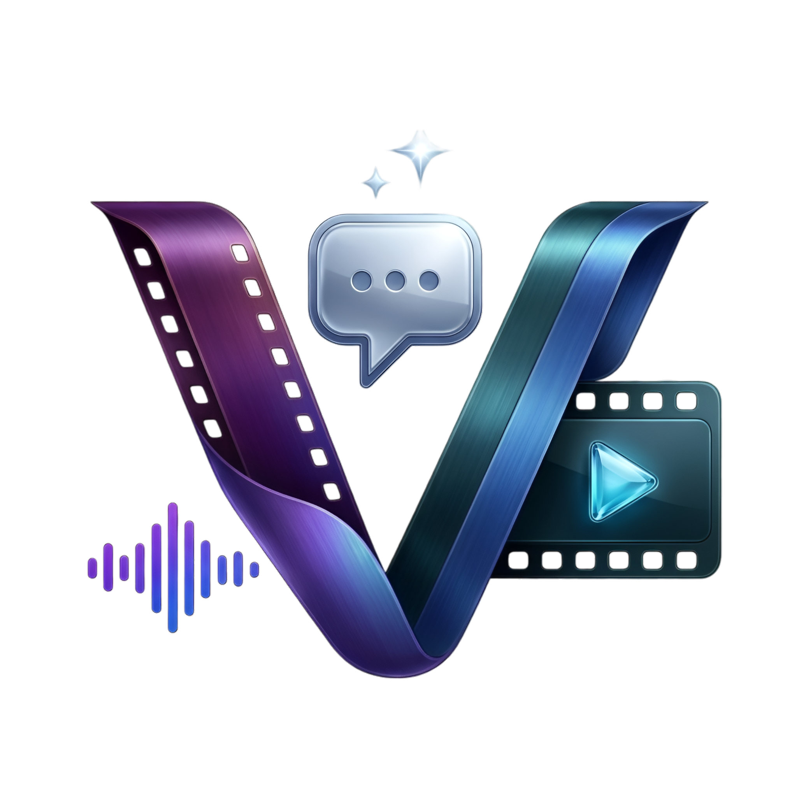

<div align="center">



# Visio Media Agent

**An AI-powered desktop application for intelligent, automated media processing**

[](https://www.electronjs.org/)
[](https://reactjs.org/)
[](https://vitejs.dev/)
[](https://www.microsoft.com/windows)
[](#license)

</div>

---

## ✨ Overview

**Visio Media Agent** is a desktop application that turns natural language instructions into fully automated media-processing workflows. Describe what you want in plain English — *"compress this video to under 50 MB"*, *"transcribe and subtitle all these clips"*, *"extract the audio and normalize the volume"* — and the AI agent generates, executes, and self-corrects an ffmpeg/tool pipeline without you needing to touch the command line.

Under the hood it uses **Groq**, **Anthropic (Claude)**, **OpenAI**, or a **local Ollama** model as the reasoning engine, and delegates the heavy lifting to battle-tested media tools like `ffmpeg`, `whisper`, `yt-dlp`, and `ImageMagick`.

---

## 🚀 Key Features

| Feature | Description |
|---|---|
| 🤖 **AI Workflow Generation** | Describe a goal; the agent plans and executes a multi-step workflow |
| 🔁 **Self-Healing Execution** | On failure, the AI automatically diagnoses the error and retries with a corrected command (up to 3 attempts) |
| 📁 **Project Management** | Organize your work into projects with dedicated input, output, and session folders |
| 💬 **Persistent Chat History** | Every conversation is saved per-project with named chat sessions |
| 🖼️ **Media Library** | Visual browser for all input/output files with drag-and-drop import |
| 🎬 **Live Preview Panel** | Preview video, audio, and image outputs directly inside the app |
| 🛠️ **Tool Manager** | Detect, install, and manage all required external tools from one page |
| 🌐 **Multi-Provider AI** | Groq, Anthropic, OpenAI, Ollama (local), or any OpenAI-compatible endpoint |
| 🎨 **Themeable UI** | Dark / light / midnight themes with multiple accent color choices |
| 📦 **Windows Installer** | Packages as a one-click NSIS `.exe` installer via `electron-builder` |

---

## 🖥️ Screenshots

> *The app consists of three main pages accessible via the top menu bar.*

### Main Workspace
The main page shows the **Media Library** (left), **Chat Panel** (center), and **Preview Panel** (right). Drag files onto the window from anywhere to instantly add them to the project library.

### Tools Page
Scan for installed tools, view installation instructions per-OS, and one-click install missing dependencies directly from within the app.

### Settings Page
Configure your AI provider (Groq, Anthropic, OpenAI, Ollama), paste API keys, choose a model, and tune temperature/max-tokens — plus pick your preferred theme and accent color.

---

## 🏗️ Architecture

```
Vizio-app/
├── electron/                  # Electron main process
│   ├── main.js                # IPC handlers, AI calls, workflow engine
│   ├── ffmpeg.js              # ffmpeg/ffprobe runner, tool scanner, session logger
│   ├── preload.js             # Context bridge (renderer ↔ main)
│   └── projectStore.js        # Project, chat, and file-system management
│
├── src/                       # React renderer process
│   ├── App.jsx                # Root: routing, global drag-and-drop, theme
│   ├── components/
│   │   ├── chat/              # ChatPanel (message list, input, multi-file select)
│   │   ├── layout/            # MenuBar, ExecutionBar
│   │   ├── library/           # MediaLibrary (file browser & selector)
│   │   ├── preview/           # PreviewPanel (video/audio/image viewer)
│   │   └── project/           # ProjectGate (create / open project)
│   ├── pages/
│   │   ├── MainPage.jsx       # Three-panel workspace layout
│   │   ├── ToolsPage.jsx      # Tool status, install, docs
│   │   └── SettingsPage.jsx   # AI provider config & appearance
│   └── store/
│       └── settingsStore.js   # Persistent settings (provider, model, theme)
│
├── index.html
├── vite.config.js
└── package.json
```

---

## ⚙️ How It Works

```
User types a goal  →  Agent reads media metadata (ffprobe)
                   →  AI generates a multi-step JSON workflow
                   →  Each step runs as an ffmpeg / shell command
                   →  Exit 0 → next step
                   →  Non-zero → AI diagnoses & retries (max 3×)
                   →  Outputs saved to project/output/
                   →  Results shown in the Preview panel
```

The AI never writes brittle one-liners — it produces a structured workflow object with individually trackable steps, real-time progress, and a full session log.

---

## 🛠️ Supported External Tools

The **Tools** page detects and (on Windows) auto-installs all of these:

| Tool | Purpose | Install |
|---|---|---|
| **ffmpeg** | Video/audio encoding, filtering, trimming | `winget install Gyan.FFmpeg` |
| **ffprobe** | Media file inspection (ships with ffmpeg) | — |
| **Python 3.11** | Runtime for pip-based tools | `winget install Python.Python.3.11` |
| **OpenAI Whisper** | Speech-to-text, subtitles (SRT/VTT) | `pip install openai-whisper` |
| **yt-dlp** | Download from YouTube & 1000+ sites | `pip install yt-dlp` |
| **ImageMagick** | Frame-level image manipulation | `winget install ImageMagick.ImageMagick` |
| **pyannote** | Speaker diarization (requires HF token) | `pip install pyannote.audio` |

---

## 🧠 Supported AI Providers

Configure any of these in **Settings → API & models**:

| Provider | Models | Key Required |
|---|---|---|
| **Groq** | `llama-3.3-70b-versatile`, `mixtral-8x7b` | ✅ |
| **Anthropic** | `claude-opus-4-5`, `claude-sonnet-4-5` | ✅ |
| **OpenAI** | `gpt-4o`, `gpt-4-turbo` | ✅ |
| **Ollama** | Any locally pulled model | ❌ (local) |
| **OpenAI-compatible** | Any custom endpoint | Optional |

---

## 📦 Prerequisites

- **Node.js** 18+ and **npm**
- **ffmpeg** installed and on your system `PATH`
- An API key for your chosen AI provider (or Ollama running locally)

---

## 🚀 Getting Started

### 1. Clone the repository

```bash
git clone https://github.com/your-username/Vizio-app.git
cd Vizio-app
```

### 2. Install dependencies

```bash
npm install
```

### 3. Configure your AI provider

Launch the app and go to **Settings → API & models**. Paste your API key and choose a model. For Ollama, just point the endpoint at `http://localhost:11434`.

### 4. Run in development mode

```bash
npm run dev
```

This starts the Vite dev server and Electron simultaneously using `concurrently`.

### 5. Build the Windows installer

```bash
npm run build
```

The packaged `.exe` installer is output to `dist-electron/`. The installer:
- Lets users choose the install directory
- Creates a desktop shortcut
- Bundles everything — no separate Node.js install needed on end-user machines

---

## 🎯 Usage Walkthrough

1. **Create or open a project** — Choose a folder where media files and outputs will live.
2. **Add media files** — Drag files onto the app window, or use the Media Library panel to browse existing project files.
3. **Select context files** — In the chat panel, click the attachment icon to select one or more files to include in the AI's context.
4. **Describe your goal** — Type your request in plain English: *"Trim the first 10 seconds, add subtitles, and export as 1080p MP4"*.
5. **Review the workflow** — The agent proposes a step-by-step plan before executing.
6. **Watch it run** — Real-time progress per step, with automatic retry on failure.
7. **Preview the output** — Click any output file to preview it inline. Open it in your system player via the preview panel.

---

## 🧩 Project Structure Details

### Session Logging

Every workflow run creates a structured JSON session log at `<project>/sessions/<sessionId>.json`, containing:
- The original user goal
- The full workflow plan
- Per-step status (`running` / `completed` / `failed`)
- All commands, stdout, stderr, and AI fix attempts

### Batch Processing

The workflow engine supports a `batch_shell` step type that automatically fans out a single command template across multiple input files — for example, compressing an entire folder of videos in one go.

### Non-Shell Steps

Beyond `shell` commands, the agent can also:
- **rename** / **move** files within the project
- **delete** media files
- **write** text files (e.g., subtitle files, scripts)

---

## 🔧 Development Scripts

| Command | Description |
|---|---|
| `npm run dev` | Start Vite + Electron in development mode |
| `npm run dev:web` | Start Vite only (browser preview) |
| `npm run build` | Build React bundle + package Electron app |
| `npm run preview` | Preview the Vite production build |
| `npm run codemap` | Regenerate `CODEMAP.md` (project structure snapshot) |

---

## 🤝 Contributing

Contributions are welcome! Please:

1. Fork the repository
2. Create a feature branch (`git checkout -b feature/my-feature`)
3. Commit your changes (`git commit -m 'Add my feature'`)
4. Push to the branch (`git push origin feature/my-feature`)
5. Open a Pull Request

---

## 📄 License

This project is licensed under the **MIT License** — see the [LICENSE](LICENSE) file for details.

---

<div align="center">

Built with ❤️ using [Electron](https://www.electronjs.org/), [React](https://reactjs.org/), [Vite](https://vitejs.dev/), and the power of AI.

</div>
